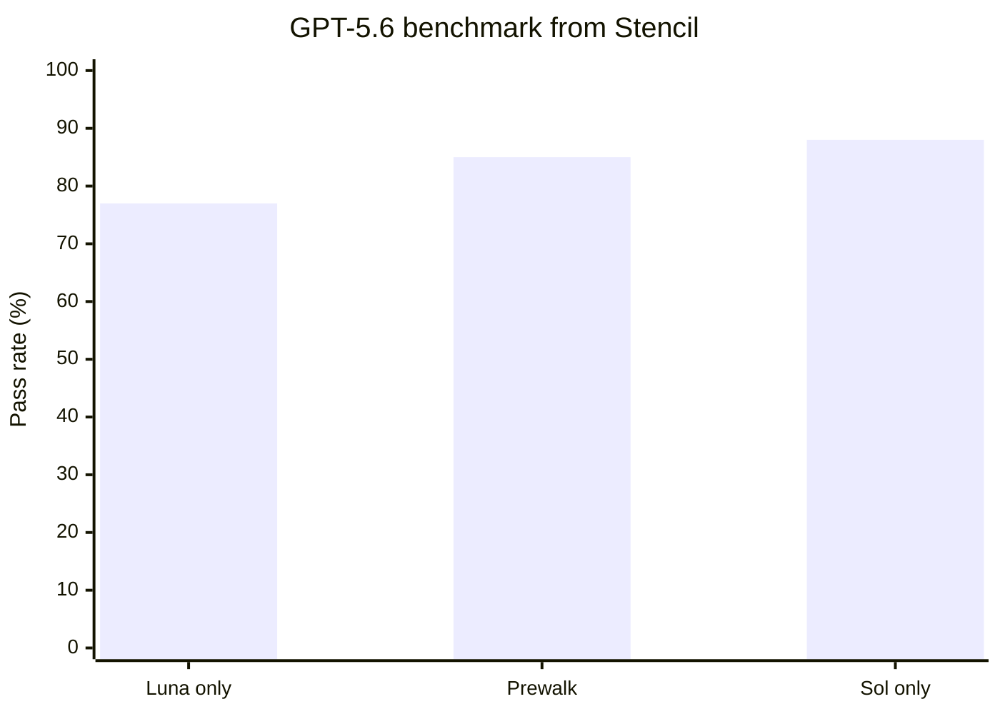

# codex-prewalk

Prewalk for Codex: use a frontier model for repository exploration, planning, and the first implementation edit, then continue the **same trajectory** with a faster/cheaper model.

Based on [Stencil's Prewalk](https://stencil.so/blog/prewalk), `pi-prewalk`, and the implementation upstreamed to `oh-my-pi`.

## 🧠 Why

A normal planner/executor split throws away the useful part of planning: the actual trajectory. The executor receives prose, then re-reads the same files and rediscovers the same constraints.

Prewalk instead lets the planner explore, build a compact todo list, and make one high-confidence edit. At that boundary the executor inherits the same thread: repository reads, tool outputs, plan state, and the first working implementation pattern.

## 🔄 How it works


Codex plugin hooks can observe tool calls but do not expose a public operation for changing the active model mid-turn. `codex-prewalk` therefore uses Codex's own `app-server` protocol as a small orchestration layer:

1. 🧭 Start a Codex thread on the planner model (default `gpt-5.6-sol`).
2. 📝 Add a planner-only Prewalk instruction and wait for a real plan.
3. ✍️ Wait for the first successful `fileChange`.
4. 🔄 Interrupt immediately after that edit lands.
5. ⚡ Continue the **same thread** on the executor model (default `gpt-5.6-luna`).
6. ✅ Finish implementation and validation.

There is no prose-plan handoff and no fresh executor thread.

## 📈 Why this can be faster / cheaper

Stencil's SWE-Bench Pro results report **97% of frontier performance, 41% lower cost, 1.9× faster completion, and ~3× less cheating** for their evaluated Prewalk setup.

For their GPT-5.6 Sol/Luna benchmark:



| Mode | Pass rate | Cost | Duration |
| --- | ---: | ---: | ---: |
| Luna only | 77% | $0.60 | 570s |
| **Sol → Prewalk → Luna** | **85%** | **$1.04** | **300s** |
| Sol only | 88% | $1.71 | 372s |

The idea is simple: **pay the frontier-model reading cost once**, then hand the already-grounded trajectory to the cheaper executor after the first confident edit.

## 🚀 Setup

Requirements:

- Node.js 18+
- A current Codex CLI with `codex app-server`
- Authentication/configuration for both selected models

Clone the repo:

```bash
git clone https://github.com/vivekascoder/codex-prefill.git
cd codex-prefill
```

Check that Codex app-server is available:

```bash
codex app-server
```

## ▶️ Run

Run Prewalk directly:

```bash
node scripts/prewalk.mjs \
  --planner gpt-5.6-sol \
  --executor gpt-5.6-luna \
  "fix the failing auth refresh tests"
```

Useful options:

```text
--planner <model>          default: gpt-5.6-sol
--executor <model>         default: gpt-5.6-luna
--planner-effort <level>   default: high
--executor-effort <level>  default: medium
--cwd <path>               default: current directory
```

Or configure defaults with environment variables:

```bash
export CODEX_PREWALK_PLANNER=gpt-5.6-sol
export CODEX_PREWALK_EXECUTOR=gpt-5.6-luna
export CODEX_PREWALK_PLANNER_EFFORT=high
export CODEX_PREWALK_EXECUTOR_EFFORT=medium
```

Then:

```bash
node scripts/prewalk.mjs "your task here"
```

## ⚙️ Implementation note

Pi exposes a direct in-process `setModel` API, so `pi-prewalk` can switch models inside one running agent turn. Codex does not expose that operation to plugin hooks today.

This implementation reaches the same practical handoff boundary through `app-server`: interrupt after the first successful edit, then issue an empty-input continuation on the same persisted thread with the executor model.

> 🧪 The orchestrator has been syntax-checked, but still needs a real end-to-end runtime test in an environment with the Codex CLI installed.
