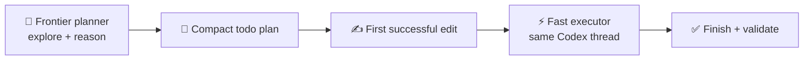
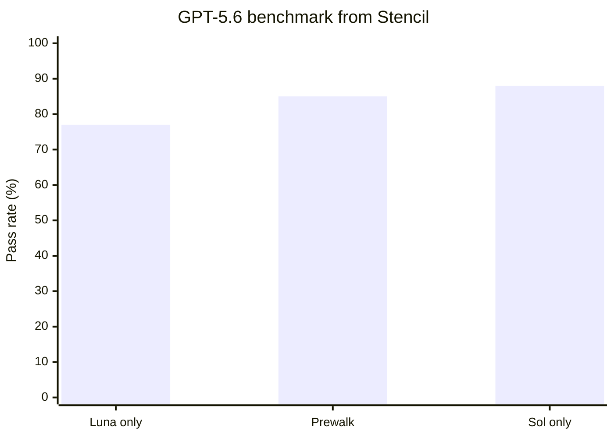

# codex-prewalk

Prewalk for Codex: use a frontier model for repository exploration, planning, and the first implementation edit, then continue the **same trajectory** with a faster/cheaper model.

Based on [Stencil's Prewalk](https://stencil.so/blog/prewalk), `pi-prewalk`, and the implementation upstreamed to `oh-my-pi`.

## 🚀 Setup

Requirements:

- Node.js 18+
- A current Codex CLI with `codex app-server`
- Authentication for the planner and executor models

Clone the plugin:

```bash
git clone https://github.com/vivekascoder/codex-prewalk.git ~/plugins/codex-prewalk
```

Add it to `~/.agents/plugins/marketplace.json`:

```json
{
  "name": "local-plugins",
  "plugins": [
    {
      "name": "codex-prewalk",
      "source": {
        "source": "local",
        "path": "./plugins/codex-prewalk"
      },
      "policy": {
        "installation": "AVAILABLE",
        "authentication": "ON_INSTALL"
      },
      "category": "Developer Tools"
    }
  ]
}
```

Restart Codex so it discovers the plugin.

## ▶️ Use

The primary interface is the Codex skill:

```text
$prewalk fix the failing auth refresh tests
```

or choose `prewalk` from `/skills`.

Defaults:

```text
planner:          gpt-5.6-sol
executor:         gpt-5.6-luna
planner effort:   high
executor effort:  medium
```

The bundled `scripts/prewalk.mjs` file is an implementation detail used by the skill; you normally do **not** run it yourself.

## 🔄 How it works



1. 🧭 Start a Codex thread on the planner model.
2. 📝 Let it inspect the repo and establish a compact plan.
3. ✍️ Wait for the first successful file edit.
4. 🔄 Interrupt immediately after that edit lands.
5. ⚡ Continue the **same thread** on the executor model.
6. ✅ Finish implementation and validation.

Codex plugin hooks do not expose a public mid-turn model-switch operation, so the skill delegates to a small orchestrator built on Codex's own `app-server` protocol. There is no prose-plan handoff and no fresh executor thread.

## 📈 Why this can be faster / cheaper

Stencil's SWE-Bench Pro results report **97% of frontier performance, 41% lower cost, 1.9× faster completion, and ~3× less cheating** for their evaluated Prewalk setup.

For their GPT-5.6 Sol/Luna benchmark:



| Mode | Pass rate | Cost | Duration |
| --- | ---: | ---: | ---: |
| Luna only | 77% | $0.60 | 570s |
| **Sol → Prewalk → Luna** | **85%** | **$1.04** | **300s** |
| Sol only | 88% | $1.71 | 372s |

The idea: **pay the frontier-model reading cost once**, then hand the already-grounded trajectory to the cheaper executor after the first confident edit.

## ⚙️ Configuration

Override defaults with environment variables:

```bash
export CODEX_PREWALK_PLANNER=gpt-5.6-sol
export CODEX_PREWALK_EXECUTOR=gpt-5.6-luna
export CODEX_PREWALK_PLANNER_EFFORT=high
export CODEX_PREWALK_EXECUTOR_EFFORT=medium
```

> 🧪 The orchestrator has been syntax-checked, but still needs a real end-to-end runtime test in an environment with the Codex CLI installed.
