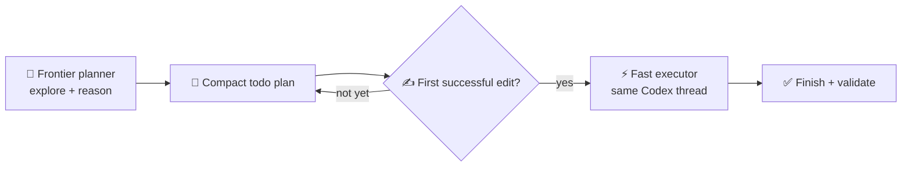
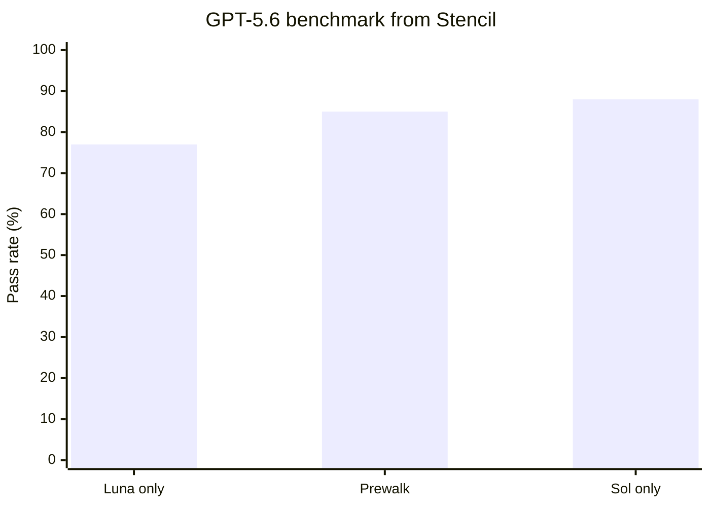

# codex-prewalk

Prewalk for Codex: use a frontier model for repository exploration, planning, and the first implementation edit, then continue the **same trajectory** with a faster/cheaper model.

Based on [Stencil's Prewalk](https://stencil.so/blog/prewalk), `pi-prewalk`, and the implementation upstreamed to `oh-my-pi`.

## 🚀 Quick install

Requirements:

- Node.js 18+
- Git
- A current Codex CLI with `codex app-server`
- Authentication for the planner and executor models

Install or update automatically:

```bash
curl -fsSL https://raw.githubusercontent.com/vivekascoder/codex-prewalk/main/install.sh | bash
```

The installer:

- clones/updates the repo at `~/.local/share/codex-prewalk`
- exposes the user skill at `~/.agents/skills/prewalk`
- uses a symlink, so updates do not duplicate files
- removes only the stale `codex-prewalk` marketplace entry created by older installer versions
- syntax-checks the orchestrator

Restart Codex after installation.

## 🛠️ Manual install

Clone the repo:

```bash
git clone https://github.com/vivekascoder/codex-prewalk.git ~/.local/share/codex-prewalk
```

Expose the skill where Codex discovers user skills:

```bash
mkdir -p ~/.agents/skills
ln -s ~/.local/share/codex-prewalk/skills/prewalk ~/.agents/skills/prewalk
```

Codex supports symlinked skill folders. Restart Codex after installation.

## ▶️ Use

```text
$prewalk fix the failing auth refresh tests
```

or choose `prewalk` from `/skills`.

Defaults:

```text
planner:                gpt-5.6-sol
executor:               gpt-5.6-luna
planner effort:         high
executor effort:        medium
planner continuations:  3
```

The bundled `scripts/prewalk.mjs` file is an implementation detail used by the skill; you normally do **not** run it yourself.

## 🔄 How it works



1. 🧭 Start a Codex thread on the planner model.
2. 📝 Let it inspect the repo and establish a compact plan.
3. ↩️ If the planner ends a turn before editing, continue the planner on the **same thread** with an implementation nudge.
4. ✍️ Wait for the first successful file edit.
5. 🔄 Interrupt immediately after that edit lands.
6. ⚡ Continue the **same thread** on the executor model.
7. ✅ Finish implementation and validation.

Planner continuation is bounded (3 extra turns by default). If the planner still cannot reach a plan + successful-edit boundary, Prewalk exits with an error instead of pretending the handoff was unnecessary.

Codex does not expose a public mid-turn model-switch operation to skills, so Prewalk delegates to a small orchestrator built on Codex's own `app-server` protocol. There is no prose-plan handoff and no fresh executor thread.

## 📈 Why this can be faster / cheaper

Stencil's SWE-Bench Pro results report **97% of frontier performance, 41% lower cost, 1.9× faster completion, and ~3× less cheating** for their evaluated Prewalk setup.

For their GPT-5.6 Sol/Luna benchmark:



| Mode | Pass rate | Cost | Duration |
| --- | ---: | ---: | ---: |
| Luna only | 77% | $0.60 | 570s |
| **Sol → Prewalk → Luna** | **85%** | **$1.04** | **300s** |
| Sol only | 88% | $1.71 | 372s |

The idea: **pay the frontier-model reading cost once**, then hand the already-grounded trajectory to the cheaper executor after the first confident edit.

## ⚙️ Configuration

Override defaults with environment variables:

```bash
export CODEX_PREWALK_PLANNER=gpt-5.6-sol
export CODEX_PREWALK_EXECUTOR=gpt-5.6-luna
export CODEX_PREWALK_PLANNER_EFFORT=high
export CODEX_PREWALK_EXECUTOR_EFFORT=medium
export CODEX_PREWALK_PLANNER_CONTINUATIONS=3
```

Installer paths can also be overridden:

```bash
export CODEX_PREWALK_DIR="$HOME/.local/share/codex-prewalk"
export CODEX_PREWALK_SKILL_DIR="$HOME/.agents/skills/prewalk"
```

> 🧪 Runtime testing found and fixed a Codex app-server compatibility issue: the current sandbox enum is `workspace-write`, not the older `workspaceWrite` value.

## License

Licensed under the [Apache License 2.0](LICENSE). Commercial use, modification, and redistribution are allowed. Redistributions and derivative works must preserve the applicable attribution notice in [NOTICE](NOTICE), which identifies the original project at `https://github.com/vivekascoder/codex-prewalk`.

## Contributing

If you're interested in contributing to codex-prewalk, please read [our contributing docs](CONTRIBUTING.md) before submitting a pull request.
